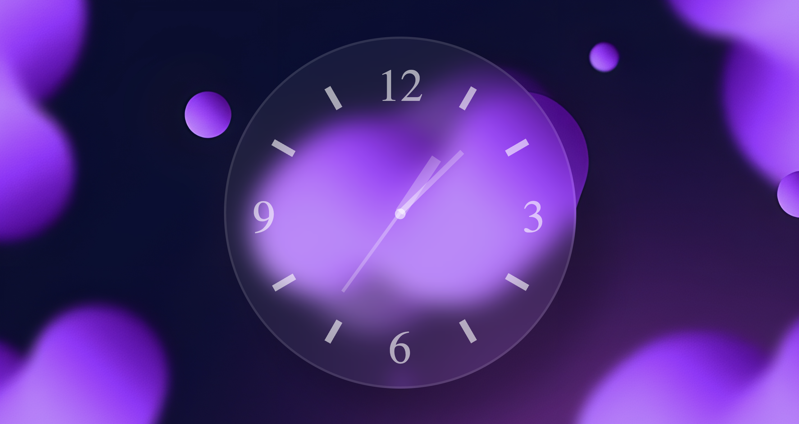

# Glassmorphism Analog Clock

This is a simple and elegant **Glassmorphism Analog Clock** built using HTML, CSS, and JavaScript. The clock features a **glass-like** background with blurred effects, making it visually appealing. The clock updates in real-time, displaying hours, minutes, and seconds with rotating clock hands.

## Features

- **Real-time Analog Clock:** The clock updates every second with the current time.
- **Glassmorphism Design:** The clock is styled with a modern, blurred, semi-transparent effect for a sleek look.
- **Zoom Feature:** The clock allows users to zoom in or out to resize the clock hands and clock container.

## Preview

  
*Zoom in or out to change the size of the clock.*

## Technologies Used

- **HTML**: For structuring the clock and the page.
- **CSS**: For styling the clock with glassmorphism effects and positioning.
- **JavaScript**: For dynamically updating the time and rotating the clock hands.

## Installation

1. Clone this repository to your local machine:
    ```bash
    git clone https://github.com/your-username/glassmorphism-analog-clock.git
    ```

2. Open the `index.html` file in your browser to view the clock.

## How to Use

1. **Viewing the Clock:**
   Simply open the `index.html` file in any modern browser to view the live clock.

2. **Zooming In and Out:**
   You can zoom in or out on the page to enlarge or shrink the clock’s size using the following methods:
   - **Browser Zoom**: Use `Ctrl` + `+` to zoom in and `Ctrl` + `-` to zoom out on most browsers. Alternatively, use `Cmd` + `+` / `Cmd` + `-` for Mac users.
   - **Mouse Scroll**: Hold the `Ctrl` key (or `Cmd` on Mac) and scroll your mouse wheel up to zoom in or down to zoom out.
   
   This will resize the clock hands and the clock container itself, providing flexibility in how you view the clock.

3. **Clock Hands Movement:**
   - The hour, minute, and second hands rotate in real-time, updating every second.
   - The minute and second hands move in precise increments as per the current time, and the hour hand gradually moves as time progresses.

## How it Works

- **HTML**: The clock is composed of a `div` container (`.clock`) that holds the clock hands (`.hour`, `.minute`, `.second`).
- **CSS**: The `.clock` container has a semi-transparent, blurred background to achieve the glassmorphism effect. The hands are styled to rotate around the bottom-center using `transform-origin: bottom center`.
- **JavaScript**: The JavaScript uses `setInterval()` to update the position of the clock hands every second, based on the current time retrieved from the `Date` object. It applies the calculated rotations using CSS `transform: rotate()`.

